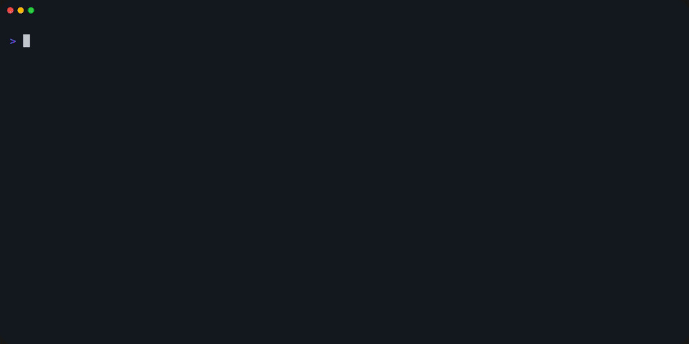

# cargo-selector

[](https://crates.io/crates/cargo-selector)

Cargo subcommand to select and execute binary/example targets



(This demo uses [Ratatui](https://github.com/ratatui-org/ratatui) as an example!)

## Installation

```
$ cargo install cargo-selector
```

### AUR

```
$ paru -S cargo-selector
```

## Usage

```
Usage: cargo selector [OPTIONS]

Options:
  -i, --inline                   Display list inline
  -n, --inline-list-size <SIZE>  List size [default: 10]
  -k, --kind <NAME>              Target kind [possible values: bin, example]
  -t, --match-type <TYPE>        Match type [possible values: substring, fuzzy]
  -h, --help                     Print help
  -V, --version                  Print version
```

Run the command in the cargo project directory:

```
$ cargo selector
```

Then, target list will be displayed, and you can execute the following command by selecting it.

```sh
# if the target is bin
$ cargo run --bin xyz [--features "foo bar"]

# if the target is example
$ cargo run --example xyz [--features "foo bar"]
```

By switching the action, you can also run only the build.

### Keybindings

| Key                               | Description                                  |
| --------------------------------- | -------------------------------------------- |
| <kbd>Down</kbd> <kbd>Ctrl+n</kbd> | cursor down                                  |
| <kbd>Up</kbd> <kbd>Ctrl+p</kbd>   | cursor up                                    |
| <kbd>Enter</kbd>                  | execute `cargo run --bin/example <selected>` |
| <kbd>Tab</kbd>                    | switch actions                               |
| <kbd>Esc</kbd> <kbd>Ctrl+c</kbd>  | quit                                         |

### Config

If the `CARGO_SELECTOR_CONFIG` environment variable specifies the path to the config file, the config will be loaded.

The config file uses the following format:

```toml
# Sets the default match type. If argument `-t` or `--match-type` is specified, it will be overridden.
# type: enum ("substring" | "fuzzy")
match_type = "substring"

# Sets the display colors.
# Colors can be set in one of the following formats:
# - ANSI color name
#   - "red", "bright-blue"
# - 8-bit color (256-color) index values
#   - "34", "128", "255"
# - 24-bit true color hex codes
#   - "#abcdef"
# type: string
[color]
bg = "reset"
action_run_bg = "green"
action_run_fg = "black"
action_build_bg = "blue"
action_build_fg = "black"
input_fg = "reset"
numbers_fg = "darkgrey"
kind_fg = "blue"
name_fg = "white"
name_match_fg = "red"
path_fg = "darkgrey"
features_fg = "darkgrey"
selected_bg = "yellow"
```

## License

MIT
